# WegertColoring.jl

This package generates images of the phase of complex values.
It uses color schemes developed by
[Elias Wegert](https://tu-freiberg.de/fakult1/ana/wegert)
in his book
[Visual Compex Functions](https://tu-freiberg.de/fakult1/ana/wegert/visual-complex-functions)
(publisher's [home page](https://link.springer.com/book/10.1007/978-3-0348-0180-5), or at
[Amazon](https://www.amazon.com/Visual-Complex-Functions-Introduction-Portraits/dp/3034801793)).

Wegert's book describes several schemes for mapping phase to colors. This package provides
code to reproduce the schemes with Julia.

A progect with a similar goal is
[ComplexPhasePortrait.jl](https://github.com/JuliaHolomorphic/ComplexPhasePortrait.jl).

## Methods

    zdomain(zll = -1.0 - im * 1.0, zur = 1.0 + im * 1.0, m = 800, n = 800)
Return an m×n matrix of complex values evenly spaced in the rectangle

    real(zll) ≤ real(z) ≤ real(zur)
    imag(zll) ≤ imag(z) ≤ imag(zur)

----------------------------------------------------------------------

    plot_phase(fz::Matrix{<:Complex}, cs::Symbol = :c,
               pres::Integer = 20, t::Vector{<:Complex} = defaultjumps(pres))
Return a matrix of RGB values corresponding to the phases of a matrix f
of complex values.

----------------------------------------------------------------------

    plot_phase!(img::Matrix{<:Colorant}, fz::Matrix{<:Complex}, cs::Symbol = :c,
                pres::Integer = 20, t::Vector{<:Complex} = defaultjumps(pres))
Return a matrix of RGB values corresponding to the phases of a matrix f
of complex values. In this version, the caller supplies a pre-allocated matrix of RGB
values.

## Color schemes

Color schemes are selected using Symbol types.  The symbols
and the corresponding color schemes are as follows:

- `:a` --- alternating black and white phase
- `:b` --- alternating black and white modulus
- `:c` --- phase plot with conformal polar grid
- `:d` --- standard domain coloring
- `:e` --- enhanced domain coloring
- `:g` --- gray levels [0, 256) corresponding to [-π, π) (not in Wegert's schemes)
- `:i` --- stripes corresponding to imaginary part
- `:j` --- colored phase plot with specific phase jumps
- `:l` --- like `:i` but spacing in integer fractions of 2π
- `:m` --- colored phase plot with module jumps
- `:n` --- like `:c`--with brighter color for background
- `:p` --- proper phase plot
- `:q` --- phase plot colored in steps
- `:r` --- conformal cartesian grid
- `:s` --- conformal polar grid
- `:t` --- polar chessboard--light gray
- `:u` --- polar chessboard
- `:v` --- cartesian chessboard
- `:w` --- cartesian chessboard--light gray

## Example

Here is a script to generate and save images for the phase of the function

    f(z) = (z - 1) / (z² + z + 1)

in the rectangular domain `zul = -2.0 - im * 2.0`, `zur = 2.0 + im * 2.0`
for each each of the color schemes:

    using ImageCore
    using FileIO
    using WegertColoring

    function save_scheme!(img, w, tgt)
        outname = "samples/$tgt.png"
        rm(outname, force = true)
        plot_phase!(img, w, tgt)
        save(outname, img)
    end

    function main()
        xres = yres = 200
        z = zdomain(-2.0 - im * 2.0, +2.0 + im * 2.0, xres, yres)
        w = (z .- 1) ./ ((z .+ 1) .* z .+ 1)
        img = zeros(RGB{N0f8}, size(w))
        schemes = [ :a, :b, :c, :d, :e, :g, :i, :j, :l, :m,
                    :n, :p, :q, :s, :t, :u, :v, :w, :x, :y]
        for c in arg
            save_scheme!(img, w, c)
        end
    end

    main()

These are images produced by the script:

| 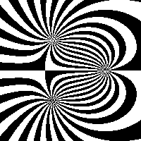 | 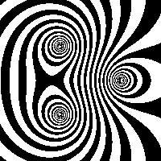 | 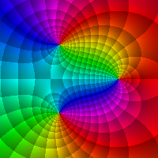
| 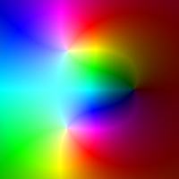 | 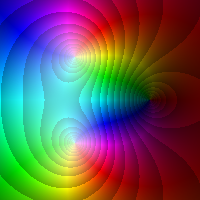 | 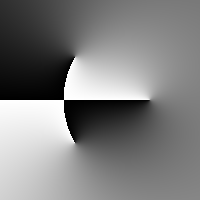
| 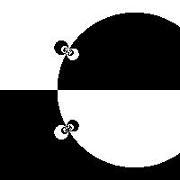 | 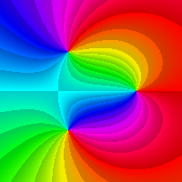 | 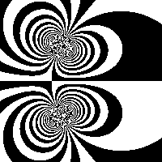
| 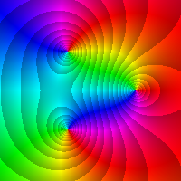 | 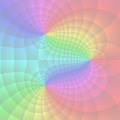 | 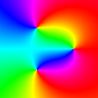
| 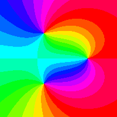 | 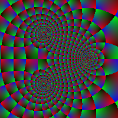 | 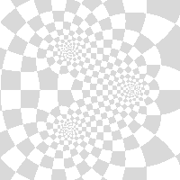
| 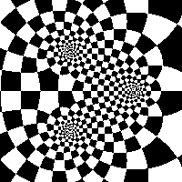 | 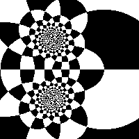 | 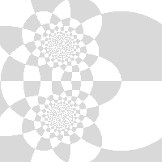
| 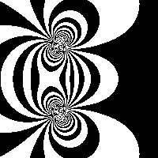 | 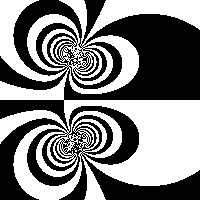
